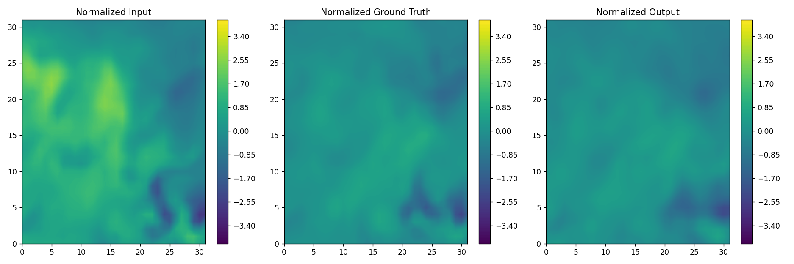
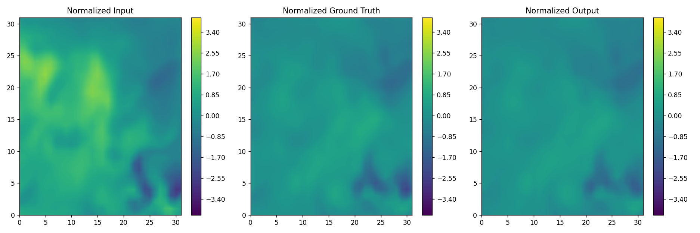

# Meteor-Pred
About An implement of AutoEncoder, Transformer and DDPM with cross-attention for Meteorlogical Graph seq-seq prediction

## Technique
- Feature extracting using basic Autoencoder with ConvNeXtV2 backbone or BYOL (not experimented)
- Implicit vector predicting using Transformer with both encoder and decoder
- Image generating using DDPM with cross-attention (better quality) or Autoencoder
- Warmup and cosine lr-scheduler
- Preprocess scripts without data augmentation

## Autoencoder Sample

## DDPM Sample
